## js-practice
JavaScript实践案例    

#### UI

> 该部分是主要结合阅读element ui源码实现，使用JS实现核心的功能以及相应的样式（并不完全实现所有功能），旨在低学习成本阐述相应的实现思路

**button**

**switch**

**slider**

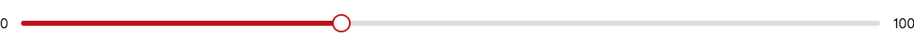

**input**

    

**loading**     
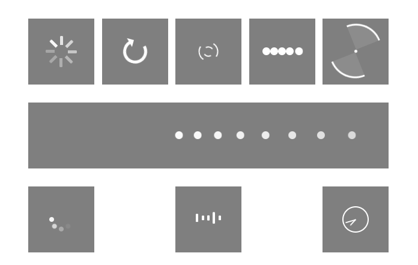     

**radio**    
   

**checkbox**   
   

**rate**    
  

**tooltip**      
   

**message**    
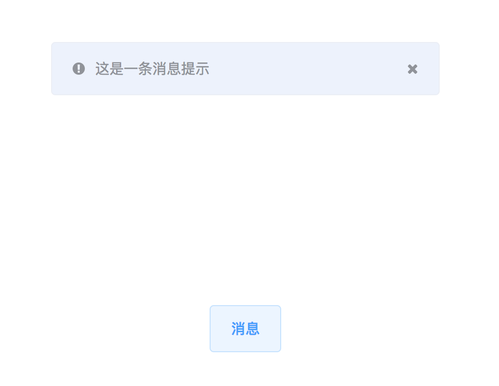   

**tabs**    
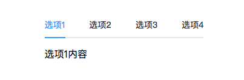    

**collapse**     
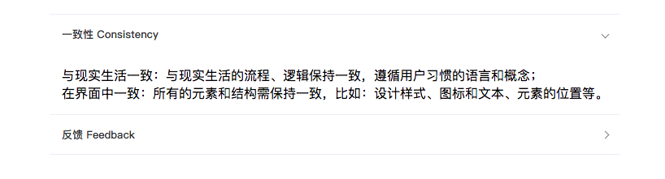   

**badge**     
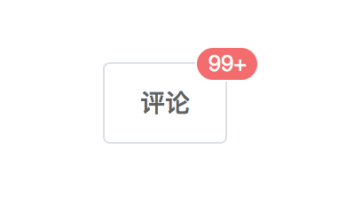    

**carousel**   
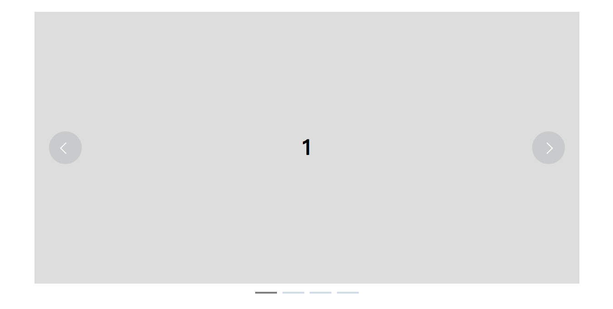  

**scrollbar**    
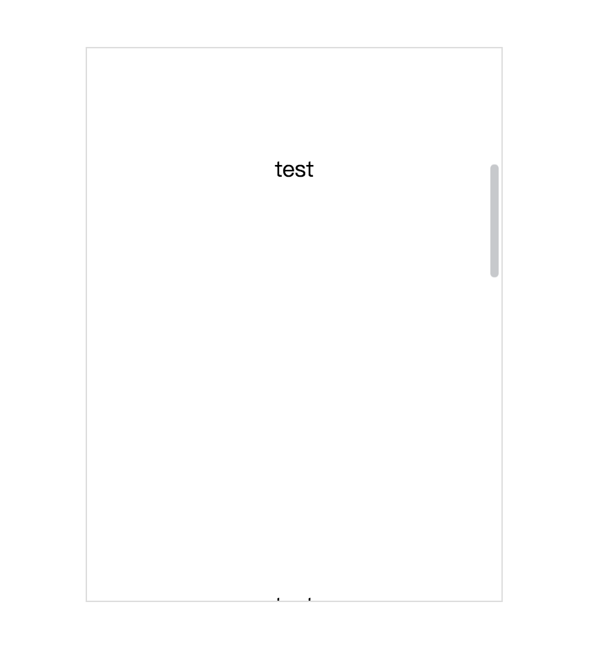      
**select**    
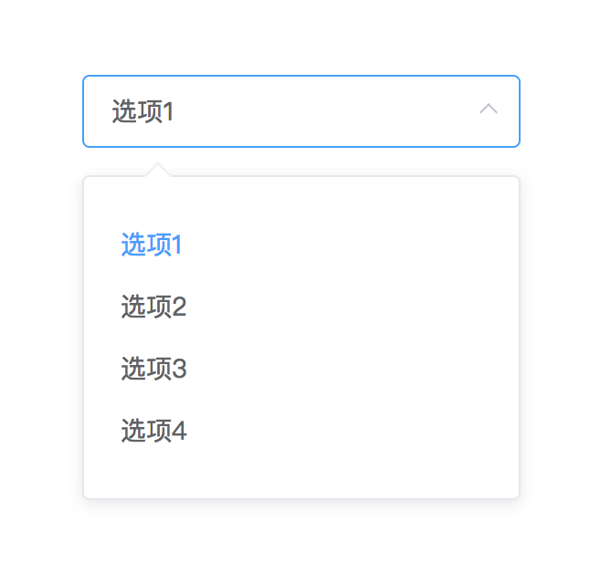   

**Notification**   
  

**MessageBox**   
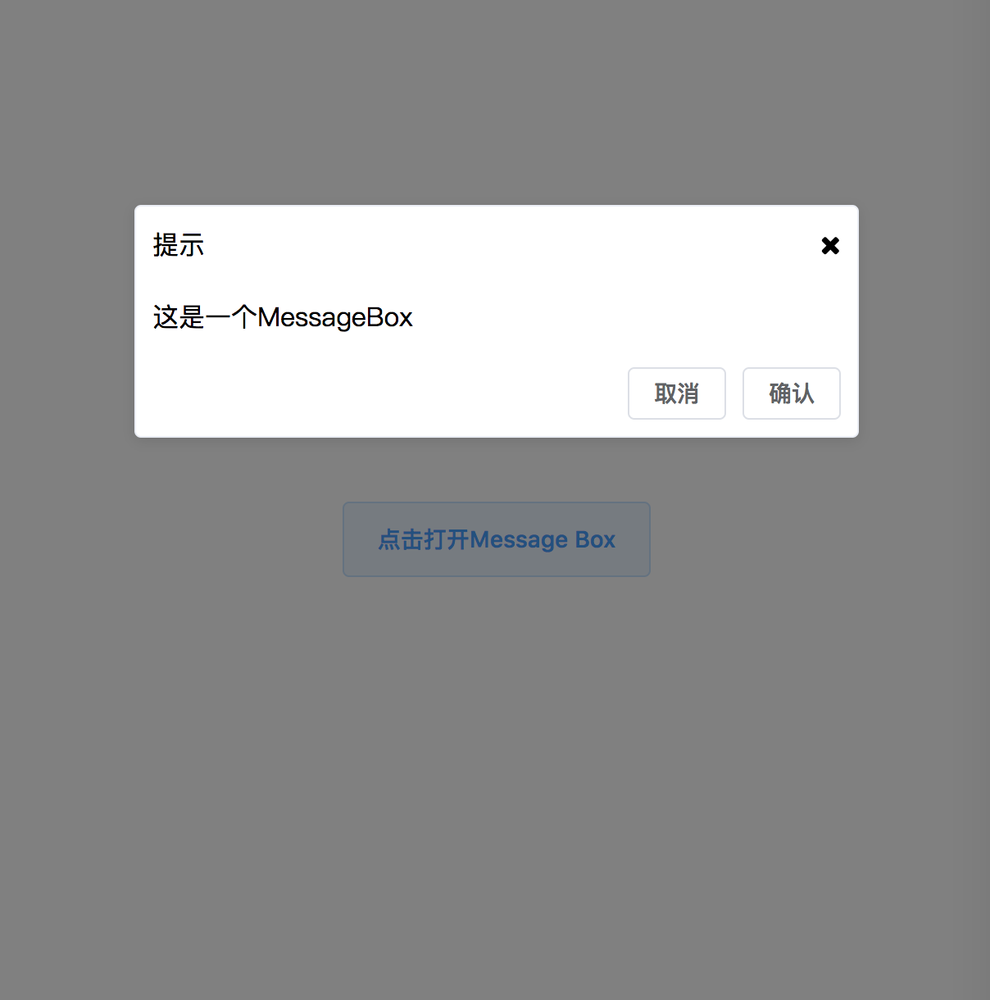  

**Color-Picker**    
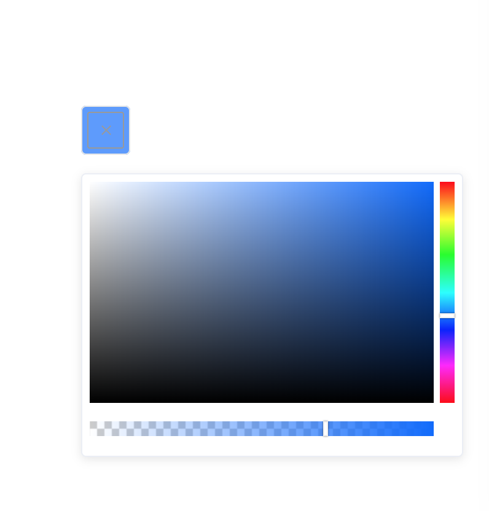    

**Upload**    
> 上传进度以及上传之后查看删除都没有在页面体现，你可以通过控制台查看上传进度
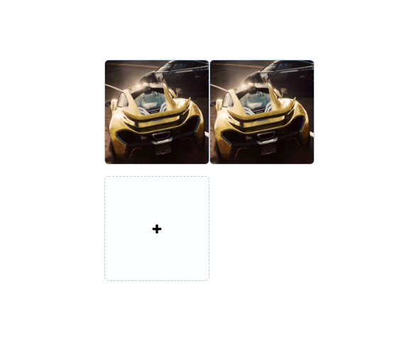    

**Table**     
> 该demo实现固定表头和固定列（只固定在左侧）的效果    
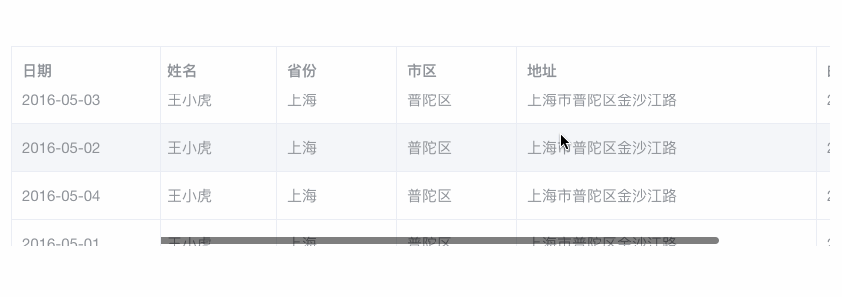           

#### 音乐播放器

[音乐播放博客文章](http://blog.csdn.net/s1879046/article/details/77898167)     
实现效果：    

#### 音频歌词同步
[音频歌词同步博客文章](http://blog.csdn.net/s1879046/article/details/78127201)    
实现效果：     
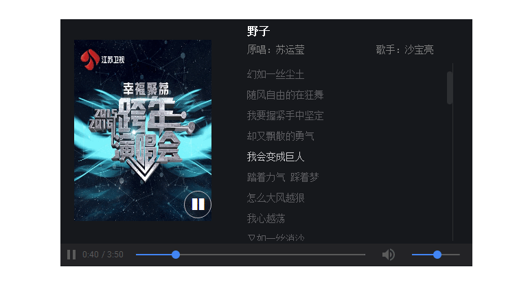
#### 日期控件     
[日期控件博客文章](http://blog.csdn.net/s1879046/article/details/78241980)     
实现效果：         
    

#### 视频播放器
[视频播放博客文章](http://blog.csdn.net/s1879046/article/details/78072683)    
实现效果：     
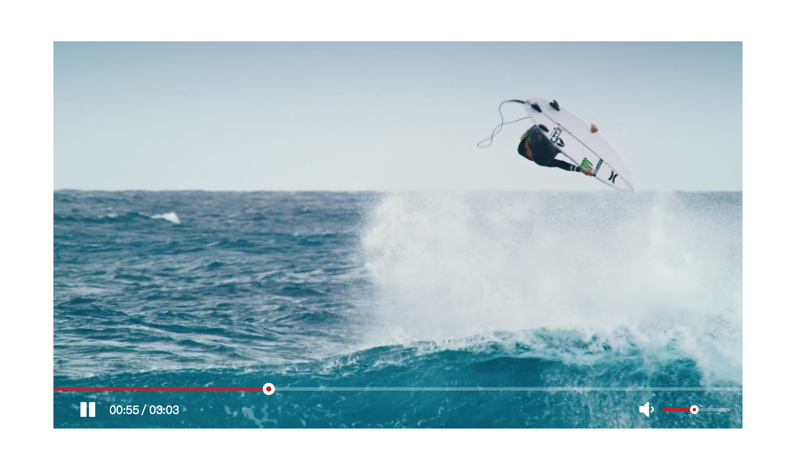

#### 粒子烟花效果    
[粒子烟花](http://blog.csdn.net/s1879046/article/details/76468768)    
#### 简易模块加载器    
[简易模块加载器博客文章](http://blog.csdn.net/s1879046/article/details/78196683)      
#### 俄罗斯方块
[俄罗斯方块博客文章](http://blog.csdn.net/s1879046/article/details/79298234)     
实现效果：    
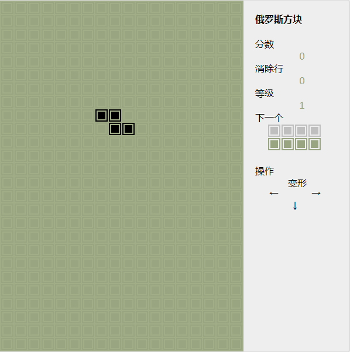    

#### 视觉差效果浅析demo效果     
[视觉差效果文章](https://blog.csdn.net/s1879046/article/details/81366042)    
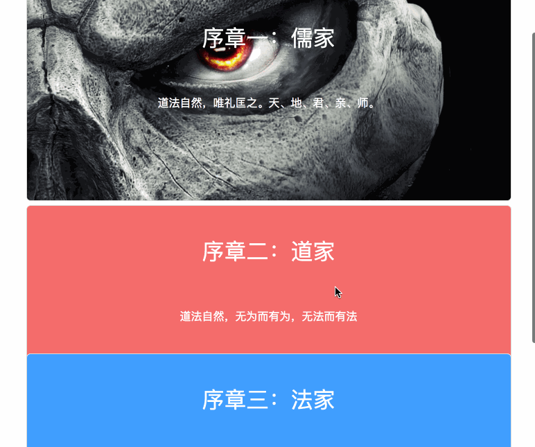   

