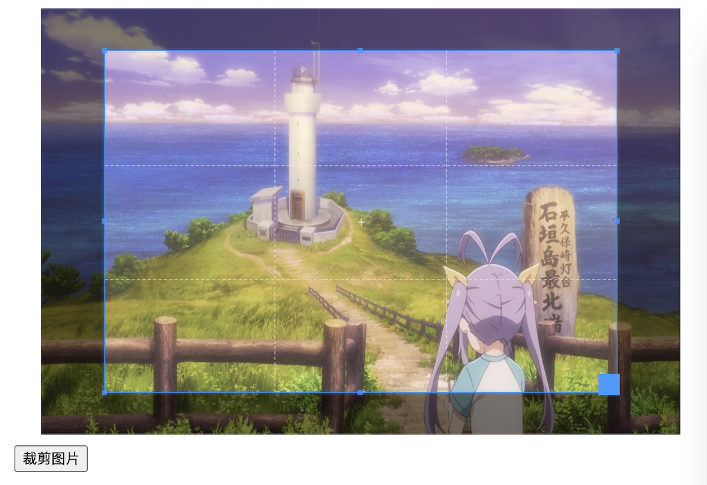
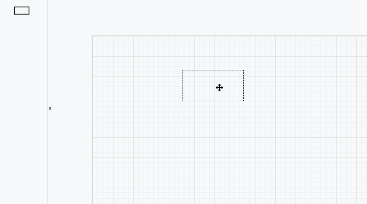
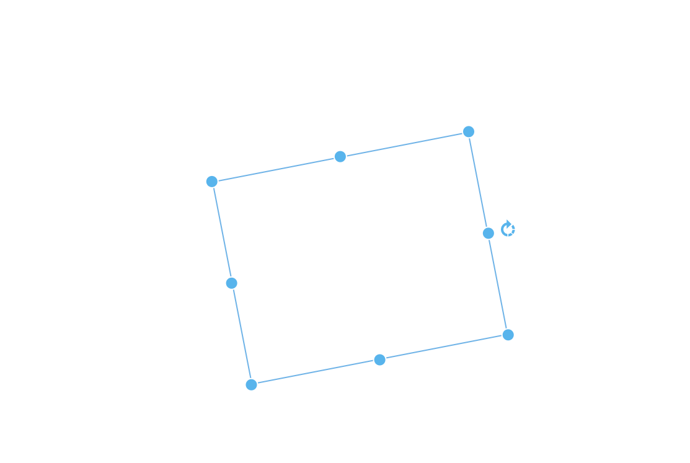

## js-practice
JavaScript实践案例    

#### js-ui   

该部分是主要结合阅读element ui源码实现，使用JS实现核心的功能以及相应的样式（并不完全实现所有功能），旨在低学习成本阐述相应的实现思路

#### 音乐播放器

[音乐播放博客文章](http://blog.csdn.net/s1879046/article/details/77898167)     
实现效果：    

#### 音频歌词同步
[音频歌词同步博客文章](http://blog.csdn.net/s1879046/article/details/78127201)    
实现效果：     

#### 日期控件     
[日期控件博客文章](http://blog.csdn.net/s1879046/article/details/78241980)     
实现效果：         
    

#### 视频播放器
[视频播放博客文章](http://blog.csdn.net/s1879046/article/details/78072683)    
实现效果：     

#### 粒子烟花效果    
[粒子烟花](http://blog.csdn.net/s1879046/article/details/76468768)    
#### 简易模块加载器    
[简易模块加载器博客文章](http://blog.csdn.net/s1879046/article/details/78196683)      
#### 俄罗斯方块
[俄罗斯方块博客文章](http://blog.csdn.net/s1879046/article/details/79298234)     
实现效果：    
    

#### 视觉差效果浅析demo效果     
[视觉差效果文章](https://blog.csdn.net/s1879046/article/details/81366042)    
   

#### 图片裁剪
裁剪框大小更改逻辑和输出裁剪图片   
   

#### 简易流程图处理   
   

#### react-ssr   
React学习和React同构的入门级demo，可以了解SSR原理、react-redux、redux、redux-thunk中间件的整合流程、react-router与react-router-config的使用、Node Express简单使用   

#### moveable   
主要用于学习rotate后resize，核心是坐标计算相关逻辑    
  

#### zoomable   
主要用于理解按照鼠标当前位置缩放内容实现相对位置不变的计算逻辑   
#### skeleton  
了解骨架屏效果   

#### count-up   
了解数字滚动动画效果    

#### seamless-scroll 
了解无缝循环滚动效果  

#### dynamic-theme   
实现动态主题   

#### animation   
实现简易JavaScript动画引擎   

#### joystick
实现虚拟摇杆逻辑  
